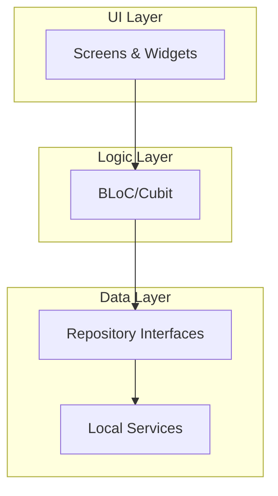
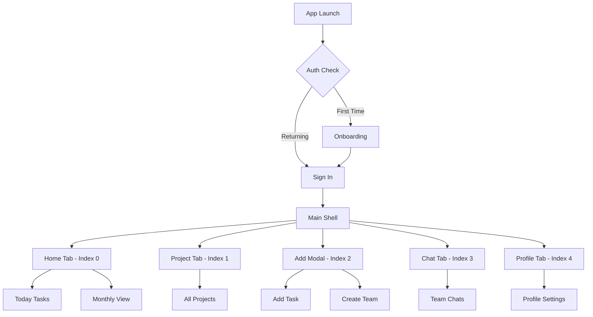

# Taskcy - Flutter Project Management App

**Taskcy** is a modern, feature-rich Flutter project management application with a JIRA-like interface but with a more friendly and intuitive UI. Built with Clean Architecture principles, it demonstrates professional Flutter development practices and modern state management patterns.

## 🎯 Project Status

**Current Stage**: Functional Prototype with Local Data Simulation  
**Architecture**: Production-Ready Clean Architecture Implementation  
**UI/UX**: Complete design system with 21+ screen mockups  
**State Management**: BLoC/Cubit pattern with comprehensive implementation

## ✨ Key Features

- 📊 **Task Management**: Create, assign, and track tasks with status updates
- 🏢 **Project Organization**: Multi-project workspace with team collaboration
- 👥 **Team Management**: User roles, team creation, and member assignment
- 💬 **Team Chat**: Real-time communication within project teams
- 📱 **Modern UI**: Beautiful, responsive design with dark/light theme support
- 🔄 **Real-time Updates**: State synchronization across all screens
- 📈 **Progress Tracking**: Visual progress indicators and statistics

## 🏗️ Architecture Overview

This project demonstrates **Clean Architecture** implementation with clear separation of concerns:



## 🧭 Navigation Structure

The app uses **GoRouter** with **StatefulShellRoute** for sophisticated navigation:



## 🏛️ Project Structure

```
lib/
├── config/
│   └── app_providers.dart          # Centralized BLoC providers
├── data/
│   ├── repositories/               # Repository implementations
│   └── services/                   # Local data services (API simulation)
├── domain/
│   ├── models/                     # Business entities
│   └── repositories/               # Repository contracts
├── routing/
│   ├── app_router.dart            # Main router configuration
│   └── [feature]_routes.dart      # Feature-specific routes
├── ui/
│   ├── core/                      # Shared infrastructure
│   │   ├── auth/                  # Authentication state
│   │   ├── navigation/            # Navigation state
│   │   ├── theme/                 # Theme system
│   │   └── widgets/               # Reusable components
│   ├── [feature]/                 # Feature modules
│   │   ├── bloc/                  # BLoC/Cubit for business logic
│   │   ├── view_model/            # View-specific data models
│   │   └── widgets/               # UI components
│   └── shared/                    # Cross-feature widgets
└── main.dart                      # App entry point
```

## 🎨 Design System

### Color Palette

- **Primary**: `#756EF3` (Purple) - Main brand color
- **Secondary**: `#D1E2FE` (Light Blue) - Supporting elements
- **Blue**: `#63B4FF` - Information and highlights
- **Green**: `#B1D199` - Success states and completed tasks
- **Orange**: `#FFB35A` - Warnings and pending states

### Theme Architecture

```dart
// Centralized color system for optimal performance
Container(color: AppColors.primary)
Card(color: AppColors.green.withValues(alpha: 0.1))
Icon(Icons.check_circle, color: AppColors.success)
```

## 🔧 State Management Strategy

### BLoC Pattern (Complex Business Logic)

- `HomeBloc`: Dashboard data with async operations
- `AddTaskBloc`: Task creation with validation
- `ProjectsBloc`: Project management with filtering
- `ProfileBloc`: User profile with statistics
- `ChatBloc`: Real-time chat functionality

### Cubit Pattern (Simple State)

- `AuthCubit`: Authentication state
- `NavigationCubit`: Tab navigation
- `ThemeCubit`: Theme switching
- `TaskListCubit`: Basic list operations

## 📱 Available Screens

The app includes comprehensive UI designs for all major features:

**Main Application Screens:**

- Home Dashboard with task overview and progress tracking
- Project management with filtering and organization
- Task creation and management forms
- Team chat and communication interface
- User profile and settings management

**Authentication & Onboarding:**

- Multi-step onboarding flow (4 screens)
- Sign in and sign up forms
- User authentication state management

**Additional Features:**

- Task detail views with status management
- Monthly task calendar view
- Team creation and management
- Profile editing and language settings
- Search functionality across all modules

## 🚀 Getting Started

### Prerequisites

- Flutter SDK (^3.8.1)
- Dart SDK
- iOS Simulator / Android Emulator
- IDE: VS Code, Android Studio, or IntelliJ

### Installation

1. **Clone the repository**

```bash
git clone https://github.com/your-username/taskcy.git
cd taskcy
```

2. **Install dependencies**

```bash
flutter pub get
```

3. **Run the app**

```bash
flutter run
```

### Development Workflow

```bash
# 🔄 Development
flutter run                        # Launch app with hot reload
flutter hot-reload                  # Trigger hot reload (or press 'r')
flutter hot-restart                 # Trigger hot restart (or press 'R')

# 📦 Dependencies & Code Generation
flutter pub get                     # Install dependencies
dart run build_runner build        # Generate JSON serialization
dart run build_runner watch        # Auto-generate on changes

# 🧪 Quality Assurance
flutter analyze                     # Static analysis
flutter test                        # Run all tests
flutter doctor                      # Check Flutter setup

# 🏗️ Building
flutter build apk                   # Android APK
flutter build ios                   # iOS (macOS only)
flutter build web                   # Web version
```

## 📦 Dependencies

### Core Framework

- **flutter_bloc** (^8.1.3) - State management with BLoC pattern
- **go_router** (^14.2.7) - Declarative routing and navigation
- **equatable** (^2.0.5) - Value equality for state objects

### Networking & Data

- **http** (^1.1.0) - HTTP client for API calls
- **json_annotation** (^4.8.1) - JSON serialization annotations
- **shared_preferences** (^2.2.2) - Local data persistence

### UI & UX

- **shimmer** (^3.0.0) - Loading state animations
- **flutter_svg** (^2.0.9) - SVG image support
- **intl** (^0.19.0) - Internationalization and date formatting

### Development Tools

- **json_serializable** (^6.7.1) - Code generation for JSON
- **build_runner** (^2.4.7) - Code generation runner
- **bloc_test** (^9.1.0) - Testing utilities for BLoC
- **mocktail** (^0.3.0) - Mocking library for tests

## 🎓 Learning Opportunities

This project demonstrates the following Flutter concepts:

### Advanced Patterns

- ✅ **Clean Architecture** - Separation of concerns with clear boundaries
- ✅ **BLoC Pattern** - Reactive state management for complex logic
- ✅ **Repository Pattern** - Data access abstraction
- ✅ **Dependency Injection** - Centralized provider configuration

### Modern Flutter Features

- ✅ **GoRouter Navigation** - Type-safe routing with nested navigation
- ✅ **StatefulShellRoute** - Persistent tab navigation
- ✅ **Theme Extensions** - Custom color system
- ✅ **Performance Optimization** - Const constructors and efficient rebuilds

### Development Best Practices

- ✅ **Feature-based Architecture** - Modular code organization
- ✅ **Error Handling** - Comprehensive error states and custom exceptions
- ✅ **Code Quality** - Linting, analysis, and conventions

## 🔍 Code Conventions

### Naming Conventions

- **Files**: `snake_case.dart`
- **Classes**: `PascalCase`
- **Methods/Variables**: `camelCase`
- **Constants**: `SCREAMING_SNAKE_CASE`

### Architecture Rules

- **Domain Layer**: No external dependencies, pure business logic
- **Data Layer**: Repository implementations, service integrations
- **UI Layer**: Widgets, state management, view models

### Performance Guidelines

- Use `const` constructors wherever possible
- Implement `Equatable` for state objects
- Use `AppColors` constants instead of theme lookups
- Prefer `withValues()` over deprecated `withOpacity()`

## 🚀 Production Readiness

### ✅ Current Implementation

- Complete Clean Architecture structure
- Professional state management setup
- Comprehensive UI component library
- Rich mock data for all features
- Modern navigation system
- Theme system with light/dark mode
